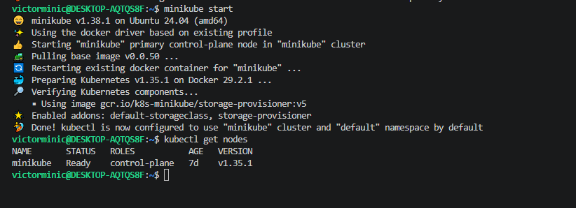
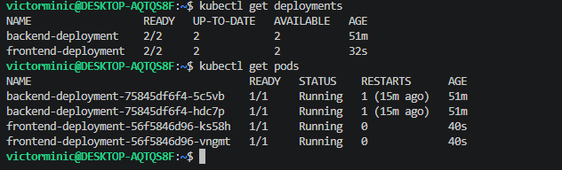
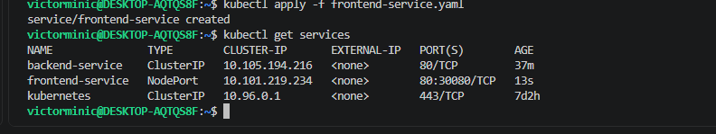
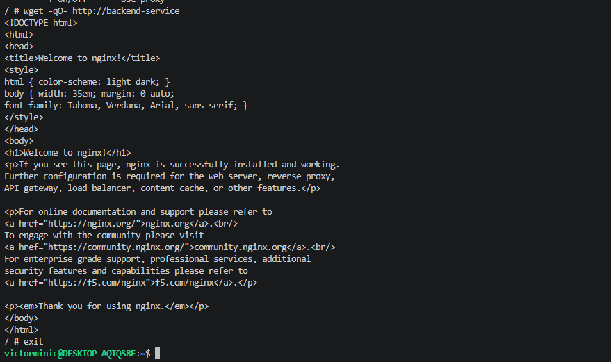
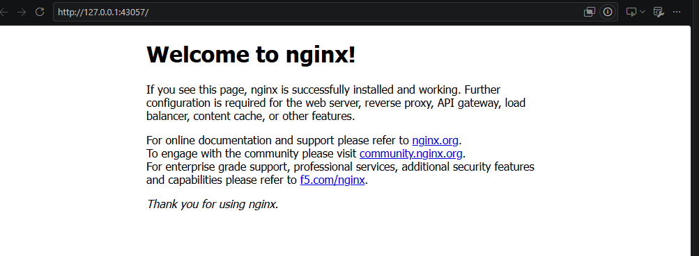
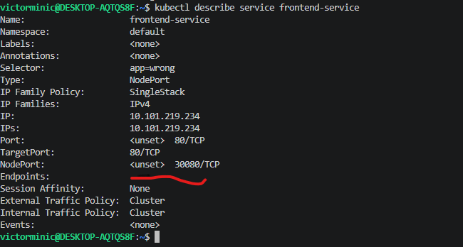
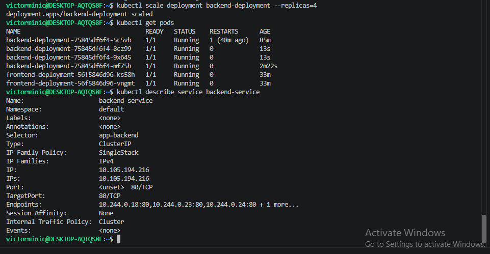

# Kubernetes Services Practical — Minikube

## 1. Project Title & Credentials

**Project Title:** Kubernetes Services Practical — Minikube

**Name:** Egwu Chidiebere Agha
**GitHub:** [@minicvictor](https://github.com/minicvictor)
**Email:** vickilance50@gmail.com

## 2. Objective

This project deploys a two-tier application (frontend + backend) on a local
Minikube cluster to demonstrate how Kubernetes Services provide a stable
network identity for Pods, even as Pods are created, destroyed, or scaled.
The backend is exposed internally with a **ClusterIP** Service and the
frontend is exposed externally with a **NodePort** Service.

## 3. Architecture

```
MINIKUBE CLUSTER
┌───────────────────────────────────────────┐
│                                             │
│   NodePort Service                         │
│   frontend-service                         │
│         │                                  │
│    ┌────┴────┐                             │
│    ▼         ▼                             │
│  Frontend Pod 1   Frontend Pod 2           │
│                                             │
│   ClusterIP Service                        │
│   backend-service                          │
│         │                                  │
│    ┌────┼────┐                             │
│    ▼    ▼    ▼                             │
│  Backend Pod 1  Backend Pod 2  Backend Pod 3...
│                                             │
└───────────────────────────────────────────┘
```

## 4. Resources Created

|Resource  |Name               |Type      |
|----------|-------------------|----------|
|Deployment|backend-deployment |Deployment|
|Service   |backend-service    |ClusterIP |
|Deployment|frontend-deployment|Deployment|
|Service   |frontend-service   |NodePort  |

## 5. Commands Used

**Part 1 — Create the cluster**

```bash
minikube start
kubectl get nodes
```

**Part 2 — Deploy the backend**

```bash
kubectl apply -f manifests/backend-deployment.yaml
kubectl get deployments
kubectl get pods
```

**Part 3 — Backend ClusterIP Service**

```bash
kubectl apply -f manifests/backend-service.yaml
kubectl get services
```

**Part 4 — Verify the backend Service**

```bash
kubectl describe service backend-service
```

**Part 5 — Test ClusterIP from inside the cluster**

```bash
kubectl run test-client --image=busybox --restart=Never --sleep 3600
kubectl get pods
kubectl exec -it test-client -- sh
# inside the pod:
wget -qO- http://backend-service
exit
kubectl delete pod test-client
```

**Part 6 — Deploy the frontend**

```bash
kubectl apply -f manifests/frontend-deployment.yaml
kubectl get deployments
kubectl get pods
```

**Part 7 — Frontend NodePort Service**

```bash
kubectl apply -f manifests/frontend-service.yaml
kubectl get services
```

**Part 8 — Access the frontend**

```bash
minikube service frontend-service
```

**Part 9 — Understand NodePort**

```bash
kubectl describe service frontend-service
```

**Part 10 — Selector experiment**

```bash
kubectl get pods --show-labels
# edit frontend-service.yaml: change app: frontend -> app: wrong
kubectl apply -f manifests/frontend-service.yaml
kubectl describe service frontend-service
# revert selector back to app: frontend, then re-apply
kubectl apply -f manifests/frontend-service.yaml
```

**Part 11 — Pod failure test**

```bash
kubectl get pods -l app=backend
kubectl delete pod <pod-name>
kubectl get pods
```

**Part 12 — Scale the backend**

```bash
kubectl scale deployment backend-deployment --replicas=4
kubectl get pods
kubectl describe service backend-service
```

## 6. ClusterIP Testing

Tested `backend-service` from inside the cluster using a temporary `busybox`
Pod (`test-client`). From inside that Pod, `wget -qO- http://backend-service`
returned the default Nginx welcome page, proving the Service resolved by
**DNS name** to a working backend Pod without needing any Pod IP.

## 7. NodePort Testing

Accessed `frontend-service` from outside the cluster using
`minikube service frontend-service`, which opened the Nginx welcome page in
the browser via the Minikube node’s IP and the Service’s assigned NodePort.

## 8. Selector Experiment

Changed the `frontend-service` selector from `app=frontend` to `app=wrong`.
The Service immediately lost all Endpoints because no Pods carried the label
`app=wrong`. This proved that Services find Pods **only** via label matching,
not by name or by Deployment ownership.

## 9. Pod Failure Experiment

Deleted one backend Pod directly. Kubernetes’ ReplicaSet controller detected
the Pod count had dropped below the desired `replicas: 2` and immediately
created a replacement Pod. The Service kept working throughout with no
manual intervention, because it was always matching on the label
`app=backend`, not on specific Pod names.

## 10. Scaling Experiment

Scaled `backend-deployment` from 2 to 4 replicas. The Service automatically
picked up the two new Pods as additional Endpoints and created it, making it 4 pods, no changes to
`backend-service.yaml` were needed, because the Service’s selector matches
any Pod with `app=backend`, regardless of how many exist.

## 11. Questions and Answers

### Part 4 — Verify the Backend Service


1. **What is the ClusterIP of backend-service?** 10.105.194.216.
2. **What selector does the Service use?** `app=backend`.
3. **How many endpoints does the Service have?** 2 (one per backend Pod, matches replica count).
4. **What Pods do the endpoints point to?** The two `backend-deployment` Pods (their individual Pod IPs on port 80).
5. **Why does the Service have two endpoints?** Because `backend-deployment` runs 2 replicas, and all 2 Pods carry the label `app=backend`, which the Service selects on..

### Part 9 — Understand NodePort


1. **What is the Service port?** 80.
2. **What is the targetPort?** 80.
3. **What is the NodePort?** 30080.
4. **Why can you access frontend-service from outside the cluster while backend-service is not directly accessible from your host?** Because `frontend-service` is type `NodePort`, which opens a port on every cluster node that forwards to the Service — reachable from outside. `backend-service` is type `ClusterIP`, which only gets a virtual IP reachable from *inside* the cluster’s internal network, by design, since the backend has no reason to be exposed externally..

### Part 10 — Service Selector Experiment


1. **What happened to the endpoints?** They dropped to zero (`<none>`) once the selector was changed to `app=wrong`..
2. **Why did the Service stop finding the Pods?** Because Services build their Endpoints list dynamically by matching their selector against Pod labels. No Pods have the label `app=wrong`, so nothing matched..
3. **What is the relationship between a Service selector and Pod labels?** A Service has no direct link to specific Pods — it continuously watches for any Pod whose labels match its selector, and routes traffic only to those. Change the labels (or the selector) and the set of Pods behind the Service changes instantly..

### Part 11 — Test Pod Failure


1. **What happened to the deleted Pod?** It was terminated and removed..
2. **Why was a new Pod created?** The Deployment’s ReplicaSet enforces the desired replica count (2). Losing a Pod dropped the actual count below desired, so the controller created a new one to reconcile..
3. **Did the backend Service disappear?** No — the Service object itself was untouched; it just briefly had one fewer endpoint until the replacement Pod became Ready..
4. **Did the Service’s ClusterIP change?** No, the ClusterIP is stable for the lifetime of the Service object regardless of Pod churn..
5. **Why is this useful in a production environment?** It means clients (or other services) never need to track individual Pod IPs. Pods can crash, be rescheduled, or replaced entirely, and traffic keeps flowing through the same stable Service address..

### Part 12 — Scale the Backend


1. **How many backend Pods are now running?** 4.
2. **How many endpoints does the Service have?** 4.
3. **Did you need to modify the Service?** No..
4. **How does the Service know about the new Pods?** The Service selector (`app=backend`) automatically matches the new Pods too, since scaling just creates more Pods with the same label — the Service’s Endpoints controller updates the list continuously without any manual step..

### Part 13 — Compare ClusterIP and NodePort

|Feature                          |ClusterIP                      |NodePort                                   |
|---------------------------------|-------------------------------|-------------------------------------------|
|Internal cluster access          |Yes                            |Yes                                        |
|External access through node port|No                             |Yes                                        |
|Default Service type             |Yes (default if unspecified)   |No                                         |
|Has ClusterIP                    |Yes                            |Yes (NodePort is built on top of ClusterIP)|
|Has NodePort                     |No                             |Yes                                        |
|Used in this assignment for      |backend-service (internal only)|frontend-service (external access)         |

## 12. Screenshots
















## 13. Lessons Learned


1. Services decouple clients from individual Pod IPs by routing through a stable virtual IP and DNS name..
2. A Service’s set of Endpoints is determined entirely by label selector matching against Pods — nothing else ties them together..
3. ClusterIP Services are only reachable from inside the cluster, which is the correct default for internal-only components like a backend..
4. NodePort Services open a port on every node, making a Service reachable from outside the cluster without needing a cloud load balancer..
5. Kubernetes Services are self-healing by nature: they automatically absorb Pod failures, replacements, and scaling events with zero manual reconfiguration, because they never target Pods directly — only labels..
